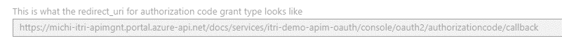

Overview
========

In this document we will be demonstrating how to protect your API behind Azure
API Management by Azure AD OAuth 2.0. We assume you have basic Azure knowledge
and understand how to create an API App on Azure.

There are several ways to protect my backend API. Microsoft official
[document](https://docs.microsoft.com/en-us/azure/api-management/api-management-howto-protect-backend-with-aad)
site has full explanation on each methods including connect to a virtual
network. In this document we are to archive below architecture. Assume we have a
backend API that is accessible for consumer applications only through API
Management (APIM). We want to protect our backend API via Azure AD, application
can only access the API through APIM with a valid OAuth 2.0 token.


To further protect your backend API, consider integrate with Virtual Network so
it only accessible from virtual network. For more information regarding Virtual
Network integration, please refer to this document:
<https://docs.microsoft.com/en-us/azure/api-management/api-management-using-with-vnet>

Reference
=========

-   Sample client application codes:
    <https://docs.microsoft.com/en-us/azure/active-directory/develop/active-directory-v2-code-samples>

-   APIM policy:
    <https://docs.microsoft.com/zh-tw/azure/api-management/api-management-access-restriction-policies#ValidateJWT>

-   Protect you backend API with Azure AD:
    <https://docs.microsoft.com/en-us/azure/api-management/api-management-howto-protect-backend-with-aad>

Create an API App
=================

In this section we will be creating a sample REST API on Azure API App. Source
codes are here. Download it and deploy to Azure API App via Visual Studio or
your favorite deployment tools. At this point you do not have to configure Azure
AD authentication as we will first verify everything works well without
authentication.

As a demo, I am using this API app here:
<https://michi-itri-demo-api.azurewebsites.net> which provides several methods


To simplify API Management setup, remember to enable swagger in your code.


1.  Goto to retrieve full swagger document, copy the content, we will need it
    later.


Create API Management Instance
==============================

2.  Follow general Azure service creation steps to create an API Management
    service instance


3.  Once created, go to APIs section


4.  Create a new API from API App in the right panel


5.  Select your API App from the list


6.  You can specify Tags or Products here or leave it empty for now


7.  Click “Create” to create APIM instance

8.  Goto the API we created above


9.  We want to edit Swagger definition so that APIM knows the full schema of our
    backed API


10.  Paste swagger content we copied from

11.  Click “Save” to save the definition


12.  Switch to “Setting” section, check everything configured correctly. By
    default you may see “Undefined” appears in “API URL Suffix” field, empty it.


13.  Click “Save” to save all changes

14.  At this point we should have basic configuration setup. In latersteps we
    will be adding Azure AD authentication to APIM and our backend API (the API
    app)

15.  Use Postman to invoke APIM endpoint as well as API App endpoint to verify
    both endpoints work well.


Configure Azure AD Applications
===============================

In this section we will create two Azure AD applications. One represents the
backend API (the API App), the other represents the client application (the API
consumer). The consumer application credential will be used to consume backend
API.

16.  Goto Azure portal, open up Azure AD console


17.  Go to Application Registration


18.  Add a new application registration


19.  Here we will be creating backend application to represents backend API

    -   Name: can be any friend name

    -   Application Type: Web app/API

    -   Sign-on Url: The URL for users to sign in to this API. We don’t really
        need this one but you have to specify a valid URI here.


20.  Once created, you should see overview like below


21.  Repeat above steps to create client application (in this document,
    michi-ITRI-API-ClientApp)

22.  Once created **client application**, click Settings


23.  Here we will allow client application to access our backend application.
    Click “Required Permissions”


24.  Click Add to add a new application


25.  Select backend application


26.  Save changes, then click “Grant Permissions”


27.  Grant access to backend API and click “Save” to save changes


28.  Here we are to generate an client secret for client application to
    authenticated. Goto “Keys”


29.  Give it a name, a duration then click “Save”


30.  Upon saving, the Key will be shown in the text field, note down the key, it
    won’t show up again


31.  Go to Properties tab, note down Application ID and APP ID URL


-   The Application ID here will be used as Client ID in later consumer codes

-   The App ID URI here will be used as Resource ID in later consumer codes

-   The key we note down in above step will be used as Client Secret in later
    consumer codes

32.  At this point we have all Azure AD authentication pre-requirements ready.
    Now we are to configure our backend API App to be authenticated by Azure AD.

33.  Open up API app console

34.  To to “Authentication/Authorization” section, enable “App Service
    Authentication” and specify “Login with Azure Active Directory”


35.  Click Azure AD to configure Azure AD


36.  Choose Advanced mode


37.  Fill in required fields

    -   Client ID: Client application’s application Id we created above

    -   Client Secret: Client applications’ key we created above

    -   Allowed toke audiences: Is the receipt of the JWT token, which is the
        client application’s resource URI we copied above


38.  Click “OK” to save changes

39.  Click “Save” to save all changes


40.  Now we have backend API protected by Azure AD.

41.  Do Postman, you should now requested to login


Configure Azure AD for APIM
===========================

In this section we will configure Azure API Management with Azure AD to protect
our backend API. Full document is here:
<https://docs.microsoft.com/en-us/azure/api-management/api-management-howto-protect-backend-with-aad>

42.  Goto Azure Portal, open Azure Activity Directory console and switch to the
    Azure AD you used above

43.  Click Endpoints


44.  Note down Authorization endpoint and Token endpoint.


45.  Token endpoint (and Authorization endpoint) are in below format:

>   [https://login.microsoftonline.com/\<AAD](https://login.microsoftonline.com/%3cAAD)
>   Tenant ID\>/oauth2/token

>   Note down AAD Tenant ID as well, we will need them later.

46.  Now open up again the backend AAD application we registered above.


47.  Note down application ID. This is the resource Id we will be configure to
    APIM later.


48.  Goto Azure Portal, open APIM management console

49.  Click OAuth 2.0 then Add. This will bring up a OAuth 2.0 form.


50.  Fill-in required information

    -   **Client registration page URL**: If your application has a registration
        page, enter the URL here. Otherwise give it a placeholder such as
        <https://localhost>

    -   **Authorization grant types:** Authentication Code


-   **Authorization endpoint URL & Token endpoint URL**: Fill in the
    authorization endpoint URL and Token endpoint URL we noted above.


-   **Additional Body parameter:**

    -   Name: resource

    -   Value: the backend resource Id we retrieved earlier.


-   Client Credential:

    -   **Client ID:** The application Id of Azure AD Client Application we
        created in Azure AD

    -   **Client Secret:** The Key we generated for Azure AD client application


-   Note down the following redirect_url



-   Click “Save”

-   Goto your Client Azure AD application page


-   Click Settings, Then Redirect URL, paste the URL we copied above


-   Click Properties, Note down the APP ID URI


51.  Now goto APIM console, Click APIs then the API we created above


52.  Under Security, check OAuth 2.0 then select the OAuth 2.0 mechanism we
    created above and then “Save” to save changes.


53.  At this point we have all OAuth 2.0 configuration ready

Create Client Application
=========================

Now we are ready to create our client application to consume backend API via
APIM

54.  Goto APIM console, Open Developer Portal


55.  Click the Backend API


56.  Choose an API, click “Try It”


57.  Copy the subscription Key


58.  To back to APIM console, Click the backend API, then Settings. Copy the base
    URL


59.  Create a console application in Visual Studio, and install latest version of
    Microsoft.IdentityModel.Clients.ActiveDirectory package.


60.  Create below method to retrieve OAuth 2.0 token from Azure AD
```csharp
protected static string GetAuthorizationHeader()
{
    AuthenticationResult result = null;
    var context = new AuthenticationContext("\<AUTHORIZATION URL\>");
    var thread = new Thread(() =>
    {
        var clientResourceUri = "\<AAD CLIENT APP RESOURCE URL\>";
        var clientCred = new ClientCredential("\<CLIENT APP ID\>", "\<CLIENT APP KEY\>");
        result = Task.Run(() => context.AcquireTokenAsync(clientResourceUri,clientCred)).Result;
    });
    thread.SetApartmentState(ApartmentState.STA);
    thread.Name = "AquireTokenThread";
    thread.Start();
    thread.Join();
    if (result == null)
    {
        throw new InvalidOperationException("Failed to obtain the JWT token");
    }
    string token = result.AccessToken;
    return token;
}
```
-   AUTHORIZATOIN URL: The endpoint URL we retrieve at Step 44.
-   AAD CLIENT APP RESOURCE URL:The Client APP ID URI at Step 31.
-   CLIENT APP ID: The Client Application ID we retrieve at Step 31
-   CLIENT APP KEY: Key generated at Step 2

61.  Add below codes to Main()
```csharp
static void Main(string[] args)
{
    var token = GetAuthorizationHeader();
    var url = "https://\<BASE URL\>/api/Values";
    var req = HttpWebRequest.Create(url) as HttpWebRequest;
    req.Headers.Add("Authorization", "Bearer " + token);
    req.Headers.Add("Ocp-Apim-Subscription-Key", "\<SUBSCRIPTION KEY\>");
    req.Method = "GET";
    using (var respStream = req.GetResponse().GetResponseStream())
    {
        using (var sr = new StreamReader(respStream))
        {
            var text = sr.ReadToEnd();
            Console.WriteLine(text);
            Console.ReadKey();
        }
    }
}
```
-   SUBSCRITION KEY: Key rettieve at Step 57
-   BASE URL: APIM Base URL at Step 58
62. Run the application to see results.