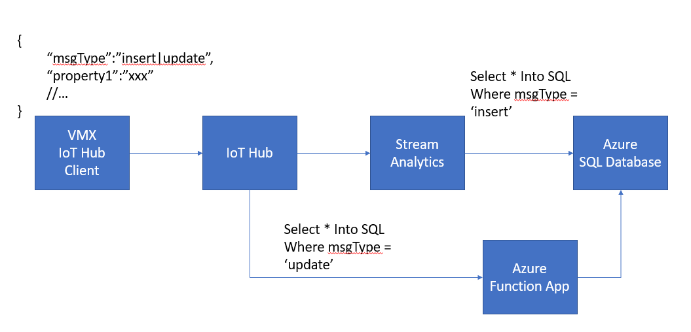
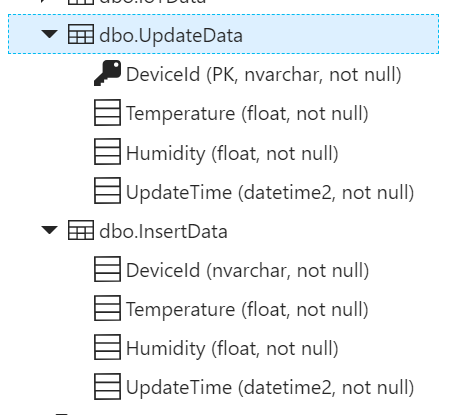

Overview
========

In this hands-on lab we will be implementing below IoT flow

-   In VMX we have a simulator device that periodically sends telemetry to IoT
    Hub

-   Stream Analytics retrieves data from IoT Hub and dispatch messages to
    different output based on msgType.

    -   Data that will be insert directly to SQL database will be routed to ASA
        SQL output.

    -   Data that will be updated to SQL database will be routed to a Function
        App.

-   A Function App is implemented to accept JSON output from ASA and update
    database accordingly

Preparation
===========

-   You need to pre-create two tables in your Azure SQL database

-   Visual Studio 2015 Community (or above)

References
==========

-   IoT Hub Device Twin:
    <https://docs.microsoft.com/zh-tw/azure/iot-hub/iot-hub-devguide-device-twins>
    (Tag/Reported Properties/Desired Properties)

-   IoT Hub device query:
    <https://docs.microsoft.com/zh-tw/azure/iot-hub/iot-hub-devguide-query-language>

-   IoT Hub Device operation monitoring:
    <https://docs.microsoft.com/zh-tw/azure/iot-hub/iot-hub-operations-monitoring#event-categories-and-how-to-use-them>

-   Azure Function: <https://docs.microsoft.com/zh-tw/azure/azure-functions/>

-   Azure Function CI/CD:
    <https://docs.microsoft.com/zh-tw/azure/azure-functions/functions-continuous-deployment>

-   Azure Function Monitoring:
    <https://docs.microsoft.com/zh-tw/azure/azure-functions/functions-monitoring>

-   Enable Azure AD Authentication:
    <https://github.com/michael-chi/EthereumFunctionAppDemo#enable-azure-ad-authentication>

-   Write Azure AD client application:
    <https://github.com/michael-chi/EthereumFunctionAppDemo#writing-client-application>

-   Kudu: function name\>.**scm**.azurewebsites.net

-   Stream Analytics

-   Patterns:
    <https://docs.microsoft.com/zh-tw/azure/stream-analytics/stream-analytics-stream-analytics-query-patterns>

-   Language Reference:
    <https://msdn.microsoft.com/en-us/azure/stream-analytics/reference/stream-analytics-query-language-reference?f=255&MSPPError=-2147217396>
