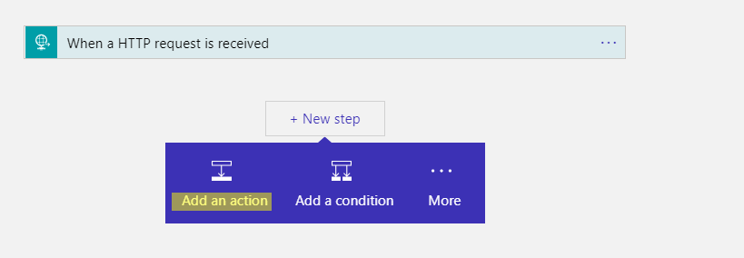

Overview
========

In this document I will be demonstrating a common scenario in EAI/B2B solutions
which is to receive JSON request in a Logic App Http Trigger, extract its fields
and invoke an external web service with those fields as parameters.

There are several ways to do this, for example, you can create an API Management
instance, APIM come with capability to import WSDL schema, so you can use it as
a proxy to talk to Web Service.

In this document, we use a public free web service as our invoking service, you
can replace it with your own web service.

The overall flow looks like below


Table of Content
================

Create Custom Connector
=======================

First we will be creating an “Adaptor” for our Logic App to connect with Web
Service. In order to do so, we will be creating a customer connector for our
Logic App

1.  Create a customer connector from your Azure Portal


2.  Give it basic information and click “Create”


3.  Once created, click “Edit”


4.  In general tab, you want to switch API endpoint to SOAP (preview) and Call
    mode to “SOAP to REST”.

>   If you have WSDL locally you can upload it, otherwise you may want to fill
>   in WSDL URL and let Azure download it for you.

>   Once specified, click “Upload”


5.  Scroll down, if you like you can give your connector an icon and description


6.  Scroll down, specify HTTP or HTTPS here depending on actual requirement from
    your web service. Here I am using a free web service which allows HTTP. You
    should leave other fields as is.

>   Once finished, click “Security”


7.  Here we allows only Basic Authentication. In my case I am using a free web
    service without authentication, hence leave it blank.

>   Click “Defination”


8.  Next, we will fine tune our Web Service interface. In my testing web service
    it exposes 4 web methods – Add, Subtract, Divide, Multiply. You can review
    each method and fill in descriptions…etc. Here I want to use Add method
    only.


9.  Once done, Click “Update Connector”


Create Logic App
================

10.  Now go back to Azure Portal, create a Logic App


11.  Open Logic App Editor, let’s start from the Http Template


12.  I want my HTTP trigger to accept JSON body and I want to simplify access to
    JSON body in my Logic App. So here I want to provide a sample JSON body so
    that Logic App knows how to extract fields from HTTP request body

>   In my case, I want to allow my HTTP client to submit a JSON body like below.
>   You may define your own JSON body schema
```json
>   {
   "arg0":3,
   "arg1":4
   }
```
13.  So I past my sample JSON to the editor. Click “Done” when completed.


14.  Next, let’s add an Action to invoke Web Service



15.  Here let’s find our newly created custom connector


16.  It automatically shows all web methods in the web service that is defined in
    our connector


17.  Click the Add method

18.  Here it lists required parameters for “Add” method – intA and intB which is
    defined in the web service WSDL. In right panel, it shows us possible fields
    in HTTP Trigger’s JSON body that we can use (as we gave a sample JSON in
    above steps)


19.  Place JSON fields in right panel to the connector parameters by click one of
    the fields listed in right panel.


20.  Click Next Step to add a new Action


21.  We want to send back HTTP response to our client application, let’s use
    Request – Response connector


22.  Specify Body as “addResponse” as we want to return “Add” method’s response
    to my client application.


23.  Save the Logic App and go back to HTTP Trigger, copy the Logic App URL


Verify
======

24.  Use your favorite HTTP testing tool to verify result


